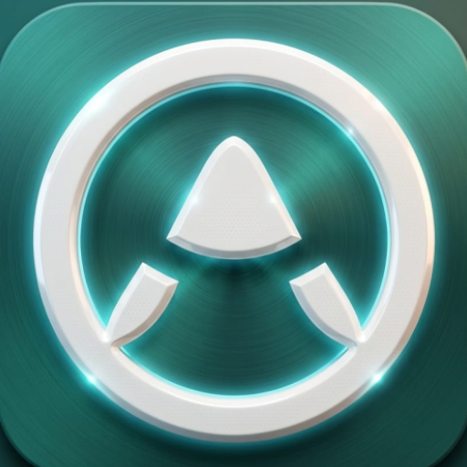
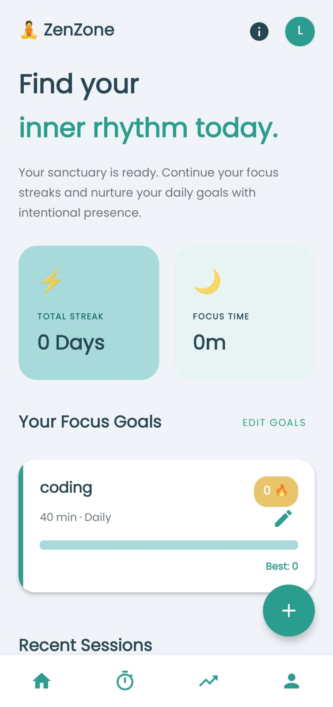
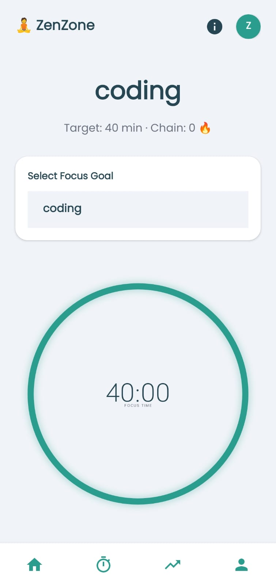
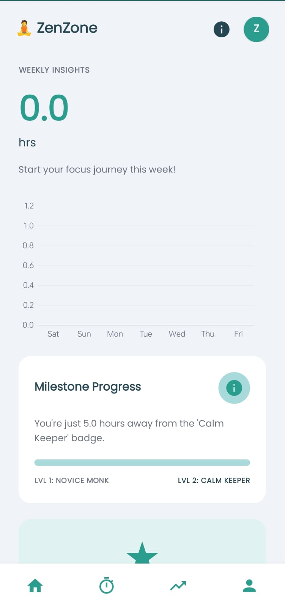
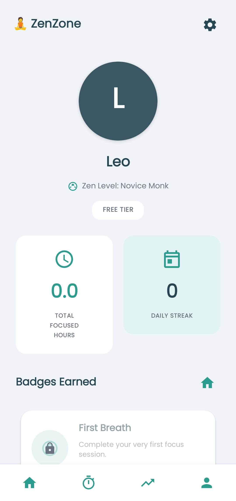

# ZenZone 🧘‍♂️

<div align="center">



**Build focus chains and find your flow**

[](https://www.android.com/)
[](https://android-arsenal.com/api?level=26)
[](https://kotlinlang.org/)
[](LICENSE)

</div>

## 📖 About

ZenZone is a productivity and focus management Android app designed to help you build consistent focus habits through gamification. Set deep work goals, track your progress, maintain focus chains, and level up your concentration skills.

### ✨ Key Features

- **🎯 Focus Goals**: Create custom focus goals with target durations and frequencies
- **⏱️ Focus Timer**: Distraction-free timer with focus lock mode
- **🔥 Chain System**: Build and maintain daily focus chains
- **📊 Statistics**: Track your progress with detailed analytics and charts
- **🏆 Achievement Badges**: Earn badges for reaching milestones
- **📈 Zen Levels**: Level up by accumulating XP through focused sessions
- **👤 User Profile**: Personalized experience with profile customization
- **🔒 Focus Lock**: Prevent navigation during active focus sessions
- **🌙 Do Not Disturb**: Optional DND mode during focus sessions
- **📱 Beautiful UI**: Modern Material Design with smooth animations

## 🚀 Getting Started

### Prerequisites

- Android Studio Hedgehog (2023.1.1) or later
- JDK 11 or higher
- Android SDK with API level 26 (Android 8.0) or higher
- Gradle 8.0+

### Installation

1. **Clone the repository**
   ```bash
   git clone https://github.com/MuhamadTalha12/zenzone.git
   cd zenzone
   ```

2. **Open in Android Studio**
   - Launch Android Studio
   - Select "Open an Existing Project"
   - Navigate to the cloned directory and select it

3. **Sync Gradle**
   - Android Studio will automatically sync Gradle files
   - Wait for the sync to complete

4. **Run the app**
   - Connect an Android device or start an emulator
   - Click the "Run" button or press `Shift + F10`

### Building APK

To build a release APK:

```bash
./gradlew assembleRelease
```

The APK will be generated at: `app/build/outputs/apk/release/app-release.apk`

## 🏗️ Architecture

ZenZone follows the **MVVM (Model-View-ViewModel)** architecture pattern with a clean separation of concerns:

```
app/
├── model/              # Data models
├── repository/         # Data layer
├── viewmodel/          # Business logic
├── ui/                 # UI layer
│   ├── main/          # Main activity & onboarding
│   ├── home/          # Home screen & goal management
│   ├── focus/         # Focus timer
│   ├── stats/         # Statistics & analytics
│   ├── profile/       # User profile
│   └── splash/        # Splash screen
└── utils/             # Utilities & helpers
```

### Tech Stack

- **Language**: Kotlin
- **UI**: Material Design Components, ViewBinding
- **Architecture**: MVVM
- **Async**: Kotlin Coroutines
- **Data Storage**: SharedPreferences + JSON (via Gson)
- **Charts**: MPAndroidChart
- **Lifecycle**: AndroidX Lifecycle Components

## 📱 Screenshots

| Home Screen | Focus Timer | Statistics | Profile |
|------------|-------------|------------|---------|
|  |  |  |  |

*Add screenshots to a `screenshots/` directory in your repository*

## 🎮 How to Use

1. **First Launch**: Complete the onboarding and enter your name
2. **Create Goals**: Tap the "+" button to create a new focus goal
3. **Start Session**: Select a goal and tap "Start Focus" to begin
4. **Build Chains**: Complete goals daily to build your focus chain
5. **Track Progress**: View your statistics and earned badges in the Stats and Profile tabs

### Focus Chain System

- Complete a goal to save your chain for the day
- Consecutive daily completions increase your chain
- Missing a day breaks your chain
- Earn bonus XP for maintaining longer chains

### Leveling System

- Earn **2 XP per minute** of focused time
- Earn **bonus XP** for maintaining chains (5 XP per chain day, max 100 XP)
- Level up by reaching XP thresholds
- Maximum level: **Level 10**

### Badges

Unlock badges by achieving milestones:
- 🌱 **First Breath**: Complete your first focus session
- 🔥 **Chain Master**: Reach various chain milestones (3, 7, 14, 30, 60, 100 days)
- ⏰ **Time Master**: Accumulate 10+ hours of focused time

## 🛠️ Configuration

### Customizing Constants

Edit `app/src/main/java/com/zenzone/app/utils/Constants.kt` to customize:

- XP rates and level thresholds
- Badge requirements
- Timer intervals
- Validation limits

### Permissions

The app requires the following permissions:
- `ACCESS_NOTIFICATION_POLICY`: For Do Not Disturb mode
- `VIBRATE`: For timer notifications
- `READ_EXTERNAL_STORAGE` / `READ_MEDIA_IMAGES`: For profile picture selection

## 🧪 Testing

Run unit tests:
```bash
./gradlew test
```

Run instrumented tests:
```bash
./gradlew connectedAndroidTest
```

## 📦 Dependencies

Key dependencies used in this project:

- AndroidX Core KTX: 1.12.0
- Material Components: 1.11.0
- Lifecycle ViewModel & LiveData: 2.7.0
- Kotlin Coroutines: 1.7.3
- Gson: 2.10.1
- MPAndroidChart: 3.1.0

See `app/build.gradle.kts` for the complete list.

## 🤝 Contributing

Contributions are welcome! Please follow these steps:

1. Fork the repository
2. Create a feature branch (`git checkout -b feature/AmazingFeature`)
3. Commit your changes (`git commit -m 'Add some AmazingFeature'`)
4. Push to the branch (`git push origin feature/AmazingFeature`)
5. Open a Pull Request

### Code Style

- Follow [Kotlin coding conventions](https://kotlinlang.org/docs/coding-conventions.html)
- Use meaningful variable and function names
- Add comments for complex logic
- Keep functions small and focused

## 👨‍💻 Author

**Muhammad Talha**
- GitHub: [@MuhamadTalha12](https://github.com/MuhamadTalha12)
- Email: boyg5615@gmail.com

## 🙏 Acknowledgments

- Material Design Icons
- MPAndroidChart library
- Android community for inspiration and support

## 📞 Support

If you encounter any issues or have questions:
- Open an [issue](https://github.com/MuhamadTalha12/zenzone/issues)
- Check existing issues for solutions
- Contact the maintainer

## 🗺️ Roadmap

Future enhancements planned:
- [ ] Cloud sync across devices
- [ ] Social features (share achievements)
- [ ] Custom themes and color schemes
- [ ] Widget support
- [ ] Pomodoro technique integration
- [ ] Focus session analytics export
- [ ] Reminder notifications
- [ ] Dark mode improvements

---

<div align="center">
If you find this project useful, please consider giving it a ⭐!

</div>
