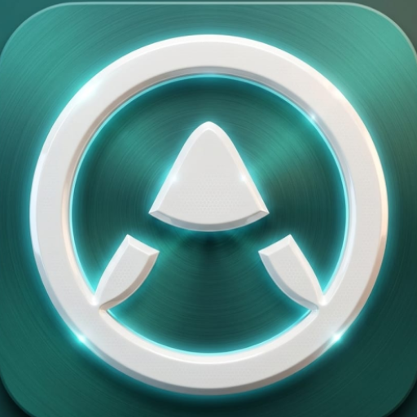
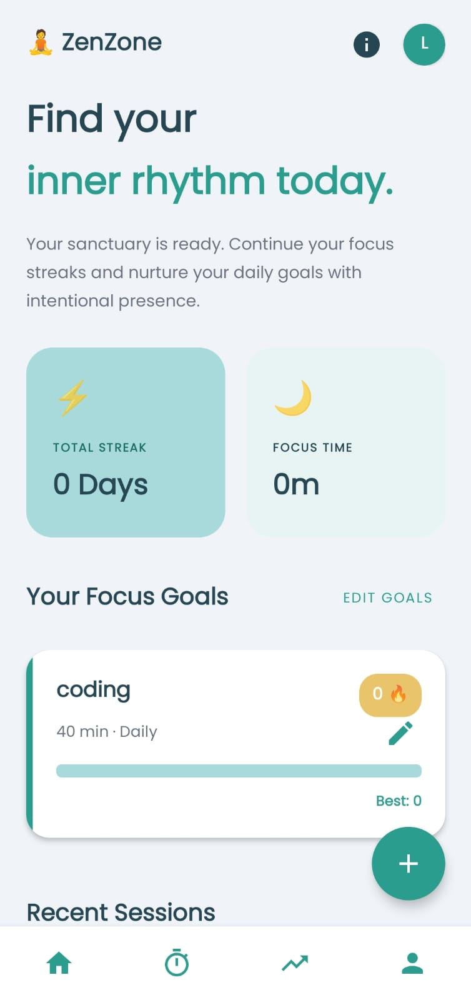
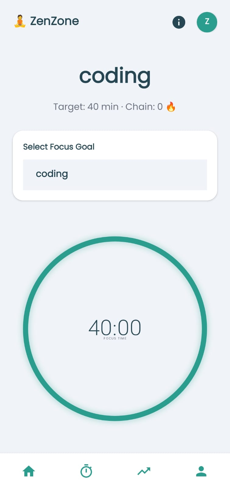
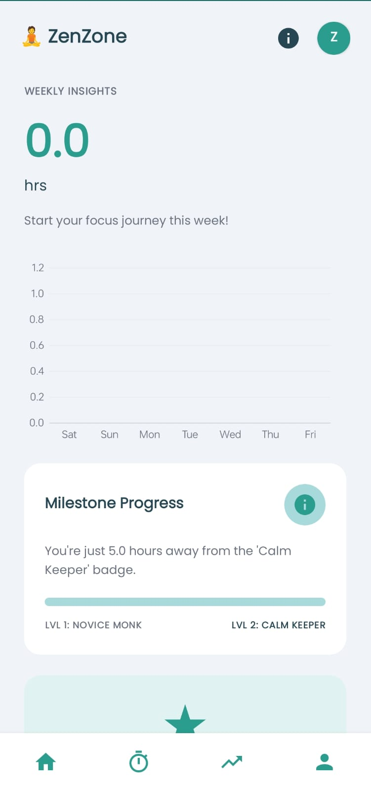
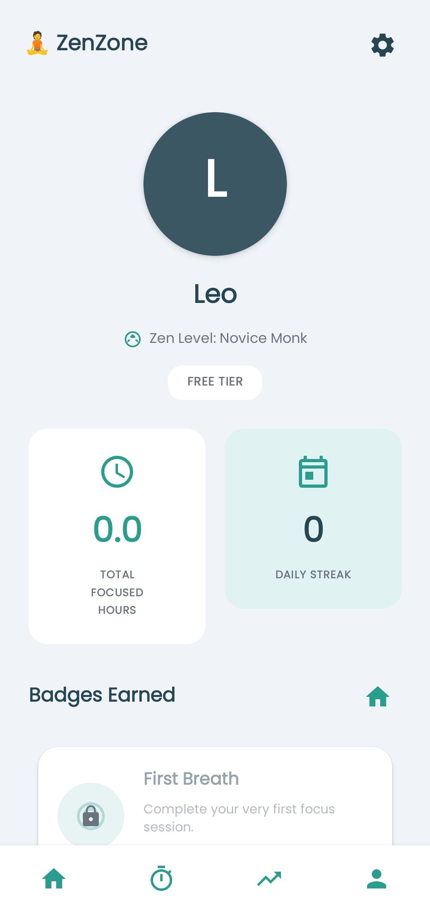

# ZenZone 🧘‍♂️

<div align="center">



**Build focus chains, nurture your digital garden, and find your flow.**

[](https://developer.android.com/)
[](https://android-arsenal.com/api?level=26)
[](https://kotlinlang.org/)
[](https://firebase.google.com/)
[](https://developer.android.com/training/data-storage/room)

</div>

---

## 📖 About ZenZone

**ZenZone** is a beautifully designed, premium productivity and focus management Android application that gamifies concentration habits. Beyond standard timers, ZenZone integrates custom focus sessions with a virtual plant-nurturing garden, daily challenges, and background synchronization to help you cultivate long-term focus habits. 

---

## 📱 Screenshots

| Home & Goals | Active Focus | Analytics & Stats | Profile & Settings |
|:---:|:---:|:---:|:---:|
|  |  |  |  |

---

## ✨ Features & What's Been Done

Here is a comprehensive breakdown of the major enhancements and features implemented in the application:

### 1. 📂 Architecture & Relational Database (Room DB)
- **Room Database Migration**: Migrated local data storage from legacy JSON file structures and SharedPreferences to a robust, thread-safe relational **Room Database** ([AppDatabase](app/src/main/java/com/zenzone/app/repository/AppDatabase.kt)).
- **Relational Entities & DAOs**: Designed database tables and Data Access Objects (DAOs) with custom asynchronous queries via Kotlin Coroutines for:
  - `FocusGoal` (Focus tasks, time goals, and completion statuses)
  - `FocusSession` (Logged completion records, elapsed times, and historical data)
  - `ChallengeEntity` (Daily randomized challenge trackers)
- **Automatic Sync Tracking**: Models are updated to include synchronization state properties (e.g., `isSynced`) to separate local and cloud operations.

### 2. ☁️ Firebase Authentication & Cloud Sync
- **Secure Accounts**: Integrated **Firebase Authentication** into [ProfileFragment](app/src/main/java/com/zenzone/app/ui/profile/ProfileFragment.kt) with dialogs for:
  - User Sign-Up and Sign-In
  - Logging out and account clearing
  - Real-time password recovery (reset emails) and password changing
- **Firestore Synchronization**: Built a centralized [FirebaseSyncManager](app/src/main/java/com/zenzone/app/utils/FirebaseSyncManager.kt) that synchronizes the user profile details, custom goals, and focus sessions to Firestore collections in the cloud.
- **Offline Capabilities (WorkManager)**: Setup a periodic `SyncWorker` that runs in the background. If you create goals or log sessions offline, it automatically syncs them to Firestore once a network connection is detected.

### 3. ⚙️ Background Foreground Service & Controls
- **Foreground Timer Service**: Created a persistent [FocusTimerService](app/src/main/java/com/zenzone/app/utils/FocusTimerService.kt) to ensure active focus sessions do not get killed when ZenZone is minimized or the screen turns off.
- **Actionable Notifications**: The service shows a persistent, ongoing notification containing live countdown updates and media-style control buttons (**Pause**, **Resume**, and **Cancel**).

### 4. 🚨 Distraction Detection ("Gentle Nudge")
- **Active App Monitoring**: Leverages the Android `UsageStatsManager` inside [UsageStatsHelper](app/src/main/java/com/zenzone/app/utils/UsageStatsHelper.kt) to detect the active foreground application.
- **Proactive Alerts**: During a focus session, the service checks the foreground app every 1.5 seconds. If you navigate away to a distracting app (e.g., *Instagram, TikTok, YouTube, Facebook, Twitter/X, Snapchat, or Pinterest*), a high-priority **Gentle Nudge** notification is fired, prompting you to return and save your streak.

### 5. 🎵 Relaxing Soundscapes
- **Ambient Focus Audio**: Built a looping media streaming player ([SoundscapePlayer](app/src/main/java/com/zenzone/app/utils/SoundscapePlayer.kt)) into the focus screen.
- **Curated Soundscapes**: Play ambient background sounds during active sessions, including:
  - 🌧️ **Rain**
  - 🌲 **Forest Wind**
  - 💨 **Brown Noise**
  - 🎧 **Lo-fi Beats**
- Soundscapes stream asynchronously and pause/resume automatically alongside the focus timer.

### 6. 🌱 Gamified Zen Garden
- **Dynamic Gardening**: Unlocked a virtual [Zen Garden](app/src/main/java/com/zenzone/app/ui/garden/ZenGardenFragment.kt) where users earn and grow digital plants using focus XP (1 new plant grown per 100 XP).
- **10 Growable Plants**: Progress from a tiny sprout to a sacred lotus:
  - 🌱 Sprout (100 XP) | 🌿 Baby Shoot (200 XP) | 🌸 Wild Flower (300 XP) | 🌵 Prickly Pear (400 XP) | 🪴 Boston Fern (500 XP)
  - 🌻 Golden Sunflower (600 XP) | 🌹 Red Rose (700 XP) | 🌳 Oak Sapling (800 XP) | 🌴 Majestic Palm (900 XP) | 🪷 Zen Lotus (1000 XP)
- **Withered Mechanic**: If you break your daily focus chain (streak returns to 0), your plants **wither** and dry up, turning brown with special emojis (🥀/🍂). Completing a new focus session instantly revives them and restores their vibrant colors!

### 7. 🏆 Daily Challenges
- **Daily Tasks**: Implemented a randomized **Daily Challenges** board ([DailyChallengeFragment](app/src/main/java/com/zenzone/app/ui/challenge/DailyChallengeFragment.kt)) with three daily slots:
  - **Focus Duration**: Focus for a target cumulative time (e.g., 25 minutes).
  - **Session Count**: Complete a specified number of separate focus runs (e.g., 2 sessions).
  - **Streak Maintenance**: Successfully keep your focus chain active.
- **Lottie Celebration**: Uses premium **Lottie Animations** to burst confetti on your screen whenever a challenge is completed.
- **Midnight UTC Resets**: Automatically schedules a `ChallengeResetWorker` to clear out old challenges and fetch/seed fresh ones at midnight UTC.

### 8. 📱 Focus Chain Home Widget
- **Home Screen Companion**: Designed a custom Android home screen widget ([FocusChainWidgetProvider](app/src/main/java/com/zenzone/app/ui/widget/FocusChainWidgetProvider.kt)).
- **Live Streak Tracking**: Shows your current daily focus chain streak (e.g., `5 🔥`) directly on your launcher. Clicking the widget opens ZenZone directly to the Focus Timer page.

### 9. 🎨 Modern Navigation Drawer UI
- **Professional Layout**: Upgraded the main interface to use a **Navigation Drawer (DrawerLayout)** with custom side options (Home, Focus Timer, Daily Challenges, Zen Garden, Statistics, Profile).
- **Dynamic Header Stats**: The side menu features a dynamic header card displaying the logged-in user's profile image, name, current Zen Level, and an XP progress bar showing how close they are to the next level.

---

## 🛠️ Technical Stack & Key Dependencies

ZenZone is built with modern, official libraries ensuring long-term maintainability:

| Dependency | Purpose | Version |
| :--- | :--- | :--- |
| **Kotlin** | Language and functional compiler features | `2.0.20` |
| **Room Database** | Relational SQLite ORM caching layer | `2.8.4` |
| **Firebase Auth & Firestore** | Cloud user accounts and data synchronization | `33.1.0 (BOM)` |
| **WorkManager** | Background synchronization and daily reset workers | `2.9.0` |
| **Lottie** | Interactive Vector Animations (Confetti / Celebrations) | `6.4.0` |
| **MPAndroidChart** | Render focus duration and streak history graphs | `v3.1.0` |
| **Mockk** | Mocking framework for local unit testing | `1.13.12` |
| **Coroutines Test** | Simulating asynchronous workflows in test pipelines | `1.7.3` |

---

## 🚀 Getting Started

### Prerequisites
- **Android Studio Koala (2024.1.1)** or later.
- **JDK 17** or higher.
- **Android SDK** configured with API level 26 (Android 8.0) or higher.

### Firebase Setup
To enable the Cloud Sync and Authentication systems:
1. Go to the [Firebase Console](https://console.firebase.google.com/) and create a new project named **ZenZone**.
2. Add an Android app with the package name `com.zenzone.app`.
3. Download the `google-services.json` file and place it in the `app/` directory of this project.
4. Enable **Firebase Email/Password Authentication** in the authentication settings.
5. Create a **Firestore Database** in test or production mode.

### Usage Access Permission
For the **Gentle Nudge** distraction warning to work, the app requires the `Usage Stats` system permission:
1. Launch the app and head to the **Focus** tab.
2. If prompted, toggle on the **Focus Lock** or attempt to begin a session.
3. The app will open your Android system settings. Find **ZenZone** in the list and toggle **Allow usage access** on.

---

## 🎮 How it Works (Core Mechanics)

### Leveling System
- Earning XP: Earn **2 XP** for every minute spent in a successful focus session.
- Daily Challenges: Earn bonus XP (+30 to +50 XP) and **Rare Seeds** (+1 Seed) upon challenge completion.
- Focus Chains: Keeping your daily focus chain active grants bonus XP:
  $$\text{Bonus XP} = \text{Current Streak} \times 5 \text{ XP (capped at 100 XP)}$$

### Garden Growth Stages
- **Seeds Bed**: 0 XP
- **Sprout Stage Garden**: 100 - 200 XP
- **Blossoming Garden**: 300 - 500 XP
- **Forest Sanctuary**: 600 - 800 XP
- **Grand Zen Paradise**: 900+ XP

---

## 🧪 Testing

The codebase comes equipped with local unit tests to verify repository transactions, XP logic, and sync helpers.

Run local unit tests:
```bash
./gradlew test
```

Run device instrumentation tests:
```bash
./gradlew connectedAndroidTest
```

---

## 📦 Building a Release APK

The project contains a built-in shell script and batch file to compile universal release APKs containing all supported architectures (`arm64-v8a`, `armeabi-v7a`, `x86`, `x86_64`) inside a single build.

To build, execute:
```bash
# Windows Power Shell / Command Prompt:
.\build-apk.bat

# Linux / MacOS:
chmod +x build-apk.sh
./build-apk.sh
```
The universal output will be exported to: `ZenZone.apk` (or `app/build/outputs/apk/release/app-release.apk`).

---

<<<<<<< HEAD
## 📄 License

This project is licensed under the MIT License - see the `LICENSE` file for details.
=======
## 👨‍💻 Author

**Muhammad Talha**
- GitHub: [@MuhamadTalha12](https://github.com/MuhamadTalha12)
- Email: boyg5615@gmail.com

## 🙏 Acknowledgments

- Material Design Icons
- MPAndroidChart library
- Android community for inspiration and support

## 📞 Support

If you encounter any issues or have questions:
- Open an [issue](https://github.com/MuhamadTalha12/zenzone/issues)
- Check existing issues for solutions
- Contact the maintainer

## 🗺️ Roadmap

Future enhancements planned:
- [ ] Cloud sync across devices
- [ ] Social features (share achievements)
- [ ] Custom themes and color schemes
- [ ] Widget support
- [ ] Pomodoro technique integration
- [ ] Focus session analytics export
- [ ] Reminder notifications
- [ ] Dark mode improvements
>>>>>>> d891a322e6dafd009102da0b6fba6cf521a38043

---

<div align="center">
<<<<<<< HEAD

**Cultivated with ❤️, ☕, and mindfulness.**

*If ZenZone helps you find your flow, please give it a ⭐ on GitHub!*
=======
If you find this project useful, please consider giving it a ⭐!
>>>>>>> d891a322e6dafd009102da0b6fba6cf521a38043

</div>
